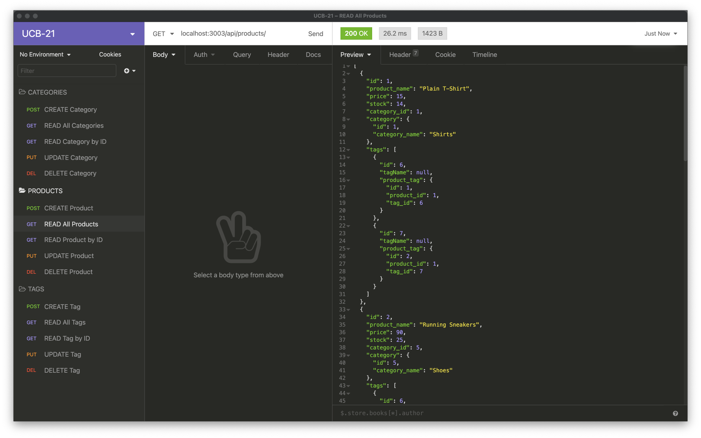

# E-Commerce Back-End

## Description
The back end for an e-commerce site that uses Express.js API and Sequelize to interact with a MySQL database.

## Table of Contents
- [Deployment URL](#Deployment-URL)
- [Repo URL](#Repo-URL)
- [Features](#Features)
- [Pre-Requisites](#Pre-Requisites)
- [Installation](#Installation)
- [Usage](#Usage)
- [Technologies Used](#Technologies-Used)
- [Questions](#Questions)
- [License](#License)

### Deployment URL
This is a back-end application. It is not deployed online.

### Repo URL
https://github.com/ahmadelgamal/e-commerce-back-end

## Features
1. Easy-to-use back-end application.
1. Manages database of online store.

## Pre-Requisites
1. Install `node.js`.
1. Install `MySQL`

## Installation
1. Download or Clone this repository.
1. If you downloaded the zipped version of this repo, then unzip it in the desired directory.
1. Go to the command line (if you're not there already).
1. Navigate to unzipped directory.
1. Run: `npm install`.
1. Create a `.env` in the root directory of the app.
1. Create the following three variables in the `.env` file:
   1. `DB_NAME=ecommerce_db`
   1. `DB_USER=`[your MySQL username]
   1. `DB_PW=`[your MySQL password]
1. Open `MySQL` CLI.
1. Run `source db/schema.sql` to create the database.
1. OPTIONAL: Go back to the regular command-line and run: `npm run seeds` to seed the databse.

## Usage
1. Run: `npm start`.
1. Open Insomnia Core, Postman, or a similar application.
1. Make API requests as demonstrated in the video (linked below).

### Screenshot

### Video Demo
[Video Link](https://youtu.be/bBhUhuJpeo8)

## Technologies Used
1. JavaScript
1. [Node.js](https://nodejs.org/en/)
1. [Express.js](https://www.npmjs.com/package/express)
1. [MySQL2](https://www.npmjs.com/package/mysql2)
1. [Sequelize](https://www.npmjs.com/package/sequelize)
1. [Dotenv](https://www.npmjs.com/package/dotenv)

## Questions
Please send your questions and / or comments to **Ahmad El Gamal** at ahmadelgamal@gmail.com, or contact me on [GitHub](https://github.com/ahmadelgamal).

## License
This project is licensed under the terms of the [MIT](https://opensource.org/licenses/MIT) license.
